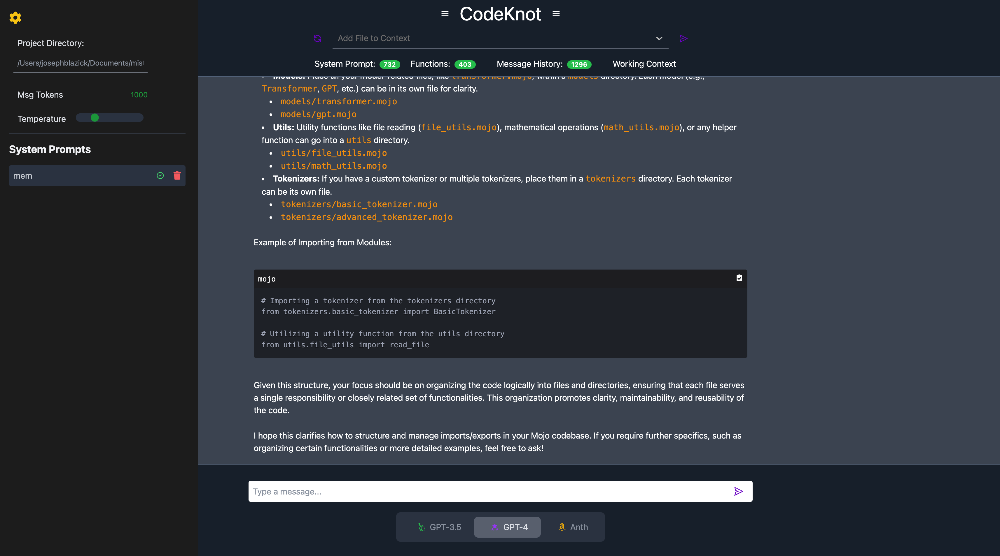

# GPT-CodeKnot 🚀

   [](https://github.com/blazickjp/GPT-CodeApp/actions/workflows/pytest_ubuntu.yml)  

Embark on a coding adventure with GPT-CodeApp, your new AI-powered coding companion! 🎉 This isn't just another Chat-GPT clone; it's your gateway to a smoother coding experience, packed with features you've always wished for.




## 📚 Table of Contents

- [Installation and Setup](#installation)
- [Usage](#usage)
- [Contributing](#contributing)
- [Tests](#tests)
- [License](#license)
- [Questions](#questions)
- [Features](#features)

## 🛠️ Installation and Setup

Setting up GPT-CodeApp is as easy as 1, 2, 3! Our application consists of a frontend and a backend, both of which need to be set up separately. 

Jump straight into action with these simple setup steps for both the frontend and backend. Let's get the engines running!

### Backend: The Brain 🧠

1. **Enter the Backend Lair:**
    ```bash
    cd backend
    ```
2. **Summon the Python Dependencies:**
    ```bash
    python3 -m venv env
    source env/bin/activate
    pip install -r requirements.txt
    ```
3. **Awaken the Backend Beast:**
    ```bash
    uvicorn main:app --reload
    ```

### Frontend: The Face 😎

1. **Dive into the Frontend Fortress:**
    ```bash
    cd frontend
    ```
2. **Gather the JavaScript Warriors:**
    ```bash
    npm install
    ```
3. **Launch the Visual Vanguard:**
    ```bash
    npm run dev
    ```

## 🗝️ Model Authentication

Before you can use the GPT-CodeApp, you'll need to authenticate with the AI models from Bedrock and OpenAI. Here's how to do it:

### Bedrock Authentication

Bedrock uses standard AWS authentication for boto3 and access to the ClaudEv2 models. Follow these steps to set it up:

1. Install the AWS CLI on your machine. You can do this by following the instructions in the [official AWS CLI User Guide](https://docs.aws.amazon.com/cli/latest/userguide/cli-configure-files.html).

2. Configure your AWS credentials by running the following command and providing your AWS Access Key ID and Secret Access Key when prompted:

    ```bash
    aws configure
    ```

3. Set the `AWS_PROFILE` environment variable to the name of the AWS profile you want to use:

    ```bash
    export AWS_PROFILE=your-profile-name
    ```

### OpenAI Authentication

OpenAI uses environment variables for authentication. Follow these steps to set it up:

1. Get your OpenAI API key. You can find this in the [OpenAI Dashboard](https://beta.openai.com/dashboard/).

2. Set the `OPENAI_API_KEY` environment variable to your OpenAI API key:

    ```bash
    export OPENAI_API_KEY=your-api-key
    ```

Now you're ready to start using the GPT-CodeApp with Anthropic and OpenAI models!

## 🎮 Usage
Dive into the GPT-CodeApp experience with these simple steps:

- **Step 1:** Launch your browser and head over to `http://localhost:3000` to greet your new AI coding companion.

- **Step 3:** Ensure you've setup authentication with either OpenAI (API KEY) or Bedrock (for Anthropic models). With authentication out of the way, you're ready to roll! Look for the sidebar on the main interface. Here, you'll find a spot to input the **full path** to the directory of your project. This is crucial for GPT-CodeApp to understand the context of your work and provide tailored assistance.
- **Step 4:** Now, it's time to ask away! Load *focus* files into the search bar at the top. Make sure to send them to the backend with the send button. Type your coding queries or dilemmas into the text box and hit submit. GPT-CodeApp will churn through its AI brain to bring you crisp, accurate coding advice or solutions.
- **Step 5:** Explore the responses, refine your questions for deeper insights, or kick off a new query. The AI is here to assist you through thick and thin code.
- **Step 6:** Base prompts can be found in the backend/agent/agent_prompts.py file and set to load in the app_setup.py. You can also add your own prompts to the file anytime. 
- **Notes:** The input text box accepts images and text. To add an image to the prompt simply copy the image and paste it into the text box.

## 🤝 Contributing

Contributions are what make the open-source community such an amazing place to learn, inspire, and create. Any contributions you make are greatly appreciated.

See [Contributing Guide](CONTRIBUTING.md)

## 🧪 Tests

