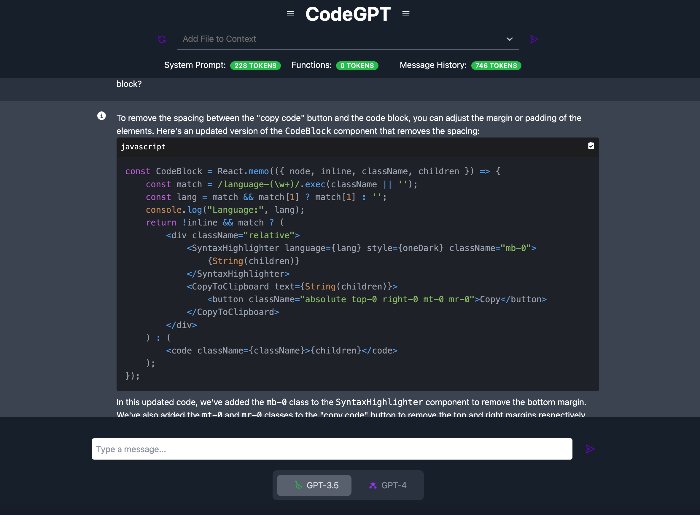

# GPT-CodeApp

> This project is a clone of Chat-GPT with all the features we wish were available. After getting frustrated by constantly copying and pasting from VS Code into the UI, losing context in the conversation memory, and having little visibility into what's going on under the hood I decided to test the AI's coding ability by making this app. This project started as a tool to better manage the model's conversational memory and context but now we're setting new goals! We're giving the models access to read, write, and edit files but the user has full control! Until these models get better (GPT-5?) we're putting more control in the users hands, but offloading all of the tedious work to the models. This App is very much still a work in progress, but come test it out!



## Todo

- [x] Initial setup
- [x] Database configuration
- [x] Code highlighting
- [x] SearchBar for adding files
- [x] Breakup the Chatbox historical messages from the current streaming message. Reduce number of re-renders.
- [x] Switch between GPT-4 and GPT-3.5
- [x] Enable easy Code Copy to clipboard from UI
- [ ] Give LLM functions to create files and add boiler plate code
- [ ] Testing
- [ ] Improve quality of conversation memory
- [ ] Edit User Files with LLM
- [ ] Support Multiple Conversations
- [ ] Support Multiple "Identities" for LLM (debugging, adding feature, refactor, etc...)
- [ ] Display Sidebar Files with a File Explorer
- [ ] Comprehensive User Documentation
- [ ] Better Interface for Adding / Changing LLM Functions
- [ ] Use Wisper to add voice interface
- [ ] Add support for Llamma & Anthropic Models
- [ ] User authentication system

## Table of Contents

- [Installation](#installation)
- [Usage](#usage)
- [Contributing](#contributing)
- [Tests](#tests)
- [License](#license)
- [Questions](#questions)

## Installation

To install necessary dependencies, run the following commands:

### Install PostgresSQL
1. Install PostgreSQL: 
   - For macOS: `brew install postgresql`
   - For Ubuntu: `sudo apt-get install postgresql`

2. Start the PostgreSQL service:
   - For macOS: `brew services start postgresql`
   - For Ubuntu: `sudo service postgresql start`

3. Create a new database:
   - Open a terminal and run `psql` to enter the PostgreSQL command-line interface.
   - If you are prompted for a password, you may need to instead run `psql -U postgres -h localhost` and provide the superuser password you provided at set-up.
   - Run the following command to create a new database: `CREATE DATABASE your_database_name;`

4. Create a database user:
   - Run the following command to create a new user: `CREATE USER your_username WITH PASSWORD 'your_password';`
   - Grant privileges to the user for the database: `GRANT ALL PRIVILEGES ON DATABASE your_database_name TO your_username;`

5. Update your application configuration:
   - Use the example `.env.sample` file in the root to create your own `.env` file. The backend code will find the file automatically for authentication.:
      ```sh
      CCODEAPP_DB_NAME=DB_FROM_SETUP_STEP3
      CODEAPP_DB_USER=USER_FROM_SETUP_STEP4
      CODEAPP_DB_PW=PW_FROM_SETUP_STEP4
      CODEAPP_DB_HOST=localhost
      IGNORE_DIRS=[node_modules,.nextm,.venv,__pycache__,.git]
      FILE_EXTENSIONS=[.js,.py,.md]
      ```
      It is important that if you are using a virtual environment not named `.venv` to add it to the ignored directories.

6. Test the database connection:
   - Restart your application and check if it successfully connects to the PostgreSQL database.

Remember to replace `your_database_name`, `your_username`, and `your_password` with your desired values.

### Enabling Audio Transcription
You need an active Google Cloud project and `gcloud` initialized.

Run these commands:
```sh
gcloud iam service-accounts create dev-audio-transcription-bot
gcloud projects add-iam-policy-binding $GOOGLE_CLOUD_PROJECT --member="serviceAccount:dev-audio-transcription-bot@$GOOGLE_CLOUD_PROJECT.iam.gserviceaccount.com" --role="roles/speech.editor"
gcloud iam service-accounts keys create dev-audio-transcription-bot.json --iam-account=dev-audio-transcription-bot@$GOOGLE_CLOUD_PROJECT.iam.gserviceaccount.com
```
Then add the path to the newly created and downloaded `.json` credential to the `.env` file.
```sh
GOOGLE_AUDIO_TRANSCRIPTION_CREDENTIALS="PATH_TO_JSON_CRED"
```

## Usage

```bash
cd /frontend
npm install
npm run dev
```

```bash
cd /backend
uvicorn main:app --reload
```

## Contributing

Contributions are what make the open-source community such an amazing place to learn, inspire, and create. Any contributions you make are greatly appreciated.

1. Fork the Project
2. Create your Feature Branch (`git checkout -b feature/AmazingFeature`)
3. Commit your Changes (`git commit -m 'Add some AmazingFeature'`)
4. Push to the Branch (`git push origin feature/AmazingFeature`)
5. Open a Pull Request

## Tests

Please provide information on how to run tests for your project, if applicable.

## License

Please provide information on the project's license (if any).

## Questions

If you have any questions about the project, please open an issue or contact the project team.

