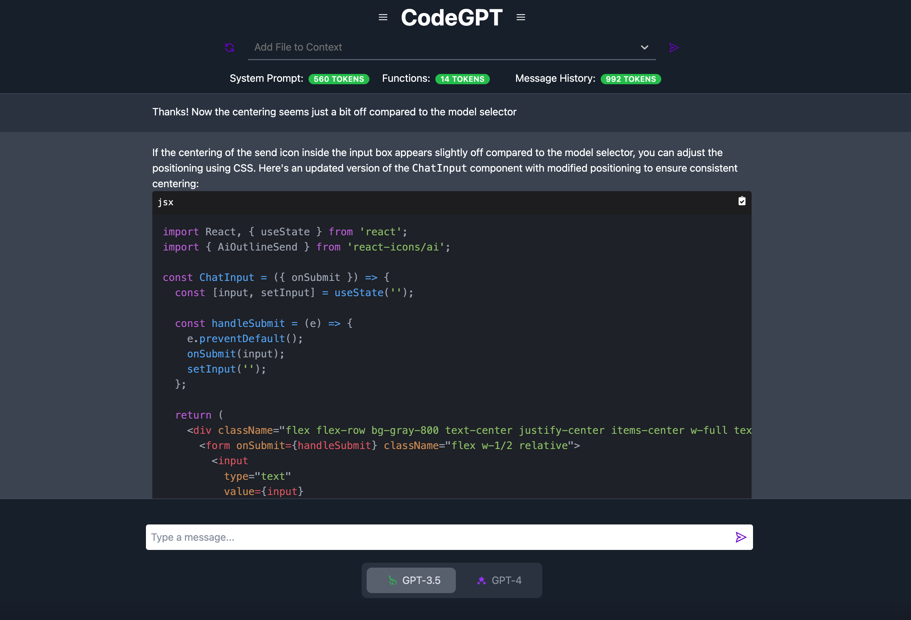

# GPT-CodeApp

  

> This project is a clone of Chat-GPT with all the features we wish were available. After getting frustrated by constantly copying and pasting from VS Code into the UI, losing context in the conversation memory, and having little visibility into what's going on under the hood I decided to test the AI's coding ability by making this app. This project started as a tool to better manage the model's conversational memory and context but now we're setting new goals! We're giving the models access to read, write, and edit files but the user has full control! Until these models get better (GPT-5?) we're putting more control in the users hands, but offloading all of the tedious work to the models. This App is very much still a work in progress, but come test it out!



## Todo

- [x] Testing
- [x] Improve quality of conversation memory
- [x] Edit User Files with LLM
- [x] Give LLM functions to create files and add boiler plate code
- [x] Support Multiple Conversations
- [ ] Support Multiple "Identities" for LLM (debugging, adding feature, refactor, etc...)
- [ ] Better Interface for Adding / Changing LLM Functions
- [ ] Use Wisper to add voice interface
- [ ] User authentication system
- [ ] Comprehensive User Documentation

## Table of Contents

- [Installation](#installation)
- [Usage](#usage)
- [Contributing](#contributing)
- [Tests](#tests)
- [License](#license)
- [Questions](#questions)

## Installation

To install necessary dependencies, run the following commands:

### Install PostgresSQL
1. Install PostgreSQL: 
   - For macOS: `brew install postgresql`
   - For Ubuntu: `sudo apt-get install postgresql`

2. Start the PostgreSQL service:
   - For macOS: `brew services start postgresql`
   - For Ubuntu: `sudo service postgresql start`

3. Create a new database:
   - Open a terminal and run `psql` to enter the PostgreSQL command-line interface.
   - If you are prompted for a password, you may need to instead run `psql -U postgres -h localhost` and provide the superuser password you provided at set-up.
   - Run the following command to create a new database: `CREATE DATABASE your_database_name;`

4. Create a database user:
   - Run the following command to create a new user: `CREATE USER your_username WITH PASSWORD 'your_password';`
   - Grant privileges to the user for the database: `GRANT ALL PRIVILEGES ON DATABASE your_database_name TO your_username;`

5. Update your application configuration:
   - Use the example `.env.sample` file in the root to create your own `.env` file. The backend code will find the file automatically for authentication.:
      ```sh
      CCODEAPP_DB_NAME=DB_FROM_SETUP_STEP3
      CODEAPP_DB_USER=USER_FROM_SETUP_STEP4
      CODEAPP_DB_PW=PW_FROM_SETUP_STEP4
      CODEAPP_DB_HOST=localhost
      IGNORE_DIRS=[node_modules,.nextm,.venv,__pycache__,.git]
      FILE_EXTENSIONS=[.js,.py,.md]
      ```
      It is important that if you are using a virtual environment not named `.venv` to add it to the ignored directories.

6. Test the database connection:
   - Restart your application and check if it successfully connects to the PostgreSQL database.

Remember to replace `your_database_name`, `your_username`, and `your_password` with your desired values.

## Usage

```bash
cd /frontend
npm install
npm run dev
```

```bash
cd /backend
uvicorn main:app --reload
```

### On-Demand Agent Function

On-Demand Agent functions are special functions that can be called on demand from the user interface differing from typical OpenAI functions in that we're forcing the function call instead of relying on the LLM to recognize when to call the function. They are designed to perform specific tasks based on user input and can greatly enhance the functionality and interactivity of the application. To call an On-Demand Agent function, you simply prepend the command with a "/".

Current On-Demand Agent Functions

 - Changes
   - Edits a file from the repository given a set of instructions. The memory of the conversation is included so you do not need
   to be overly specific in your instructions. See example below.
- CommandPlanner
   - Allows the agent to run a sequence of bash operations in a plan and execute paradigm.

#### Example

Call Agent Function - changes.py needs to be loaded into context

```
/Changes add docstring to the match_partial function
```

Function Call shown in UI

```json
{
  "file_name": "backend/agent/agent_functions/changes.py",
  "thought": "The user wants to add a docstring to the match_partial function. Docstrings are important for code readability and maintainability, as they explain the purpose of a function, its arguments, and its return value.",
  "changes": [
    {
      "original": "def match_partial(\n        self, original_lines: List[str], partial_lines: List[str]\n    ) -> Tuple[Optional[int], Optional[int], Optional[int]]:",
      "updated": "def match_partial(\n        self, original_lines: List[str], partial_lines: List[str]\n    ) -> Tuple[Optional[int], Optional[int], Optional[int]]:\n    \"\"\"\n    This function matches a part of the original code with a given part.\n\n    Args:\n        original_lines (List[str]): The original lines of code.\n        partial_lines (List[str]): The lines of code that need to be matched.\n\n    Returns:\n        Tuple[Optional[int], Optional[int], Optional[int]]: The start and end indices of the match in the original code and the number of leading spaces in the matched part.\n    \"\"\""
    }
  ]
}
```

Then the Agent also responds in the UI with the final diff of changes that were made

```diff
--- a

+++ b

@@ -236,2 +236,12 @@

-        self, original_lines: List[str], partial_lines: List[str]
-    ) -> Tuple[Optional[int], Optional[int], Optional[int]]:
+            self, original_lines: List[str], partial_lines: List[str]
+        ) -> Tuple[Optional[int], Optional[int], Optional[int]]:
+        """
+        This function matches a part of the original code with a given part.
+    
+        Args:
+            original_lines (List[str]): The original lines of code.
+            partial_lines (List[str]): The lines of code that need to be matched.
+    
+        Returns:
+            Tuple[Optional[int], Optional[int], Optional[int]]: The start and end indices of the match in the original code and the number of leading spaces in the matched part.
+        """
```

The changes were automatically saved and can always be un-done with `cntrl + z`

## Contributing

Contributions are what make the open-source community such an amazing place to learn, inspire, and create. Any contributions you make are greatly appreciated.

See [Contributing Guide](CONTRIBUTING.md)

## Tests

```bash
cd backend
python3 -m pytest 
```

## Questions

If you have any questions about the project, please open an issue or contact the project team.

