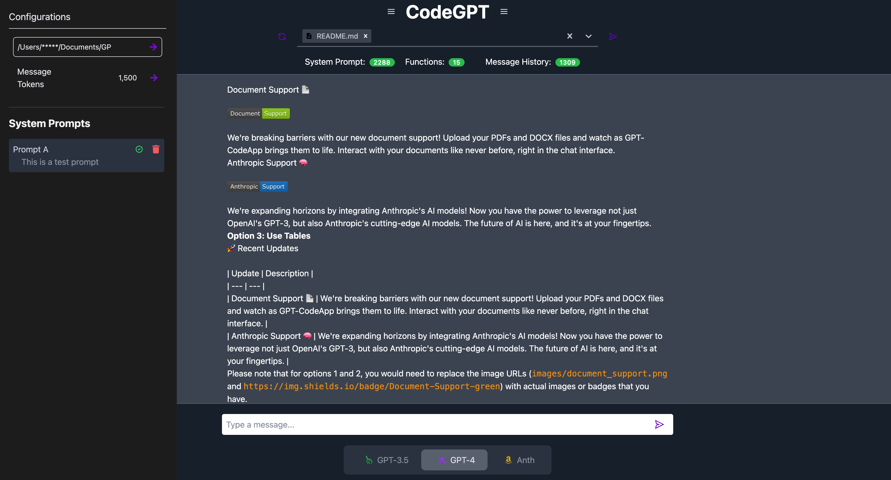

# GPT-CodeApp 🚀

   [](https://github.com/blazickjp/GPT-CodeApp/actions/workflows/pytest_ubuntu.yml)  

Welcome to GPT-CodeApp, the coding companion you didn't know you needed! 🎉 This project is a clone of Chat-GPT, but with all the features we wish were available. Tired of constantly copying and pasting from VS Code into the UI? Losing context in the conversation memory? Having little visibility into what's going on under the hood? We've got you covered!

GPT-CodeApp started as a tool to better manage the model's conversational memory and context, but we didn't stop there. We're giving the models access to read, write, and edit files, all under your control! We're offloading all the tedious work to the models, so you can focus on what matters. 

We're continuously improving and setting new goals. So, come join us on this exciting journey! 🚀




## 📚 Table of Contents

- [Installation and Setup](#installation)
- [Usage](#usage)
- [Contributing](#contributing)
- [Tests](#tests)
- [License](#license)
- [Questions](#questions)

## 🔥 Recent Updates 🔥

- **Anthropic Support:** We've added support for Anthropic, allowing you to leverage their AI models in addition to OpenAI's GPT-3. 🧠
- **Sagemaker Endpoint Support:** We're working on adding support for any Sagemaker endpoint. This will allow you to sause any model hosted on Amazon Sagemaker.
- **Prompt Management:** We've added backend support for prompt management, giving you more control over the prompts that are sent to the AI models.
- **SQLite Database:** We've moved from Postgres to SQLite for our database needs. This makes setup easier and reduces the resources required to run the application.
- **UI-Controlled Project Configuration:** You can now control the project configuration directly from the user interface, making it easier to customize the application to your needs.


## 🛠️ Installation and Setup

Setting up GPT-CodeApp is as easy as 1, 2, 3! Our application consists of a frontend and a backend, both of which need to be set up separately. Follow the steps below to get started:

### Backend Setup

The backend is a Python application that uses FastAPI. Here's how to set it up:


1. Navigate to the backend directory:

    ```bash
    cd backend
    ```

2. Install the necessary Python dependencies. We recommend doing this in a virtual environment:


    ```bash
    python3 -m venv env
    source env/bin/activate
    pip install -r requirements.txt
    ```

3. Start the backend server:

    ```bash
    uvicorn main:app --reload
    ```

The backend server will start running at `http://localhost:8000`.

### Frontend Setup

The frontend is a React application that uses Next.js. To set it up, follow these steps:

1. Navigate to the frontend directory:

    ```bash
    cd frontend
    ```

2. Install the necessary JavaScript dependencies:

    ```bash
    npm install
    ```

3. Start the frontend server:

    ```bash
    npm run dev
    ```

## 🗝️ Model Authentication

Before you can use the GPT-CodeApp, you'll need to authenticate with the AI models from Anthropic and OpenAI. Here's how to do it:

### Anthropic Authentication

Anthropic uses standard AWS authentication for boto3 and access to Bedrock models. Follow these steps to set it up:

1. Install the AWS CLI on your machine. You can do this by following the instructions in the [official AWS CLI User Guide](https://docs.aws.amazon.com/cli/latest/userguide/cli-configure-files.html).

2. Configure your AWS credentials by running the following command and providing your AWS Access Key ID and Secret Access Key when prompted:

    ```bash
    aws configure
    ```

3. Set the `AWS_PROFILE` environment variable to the name of the AWS profile you want to use:

    ```bash
    export AWS_PROFILE=your-profile-name
    ```

### OpenAI Authentication

OpenAI uses environment variables for authentication. Follow these steps to set it up:

1. Get your OpenAI API key. You can find this in the [OpenAI Dashboard](https://beta.openai.com/dashboard/).

2. Set the `OPENAI_API_KEY` environment variable to your OpenAI API key:

    ```bash
    export OPENAI_API_KEY=your-api-key
    ```

Now you're ready to start using the GPT-CodeApp with Anthropic and OpenAI models!

## 🎮 Usage

Now that you've set everything up, you're ready to start using GPT-CodeApp! Open `http://localhost:3000` in your web browser and start exploring. 

We've also added some cool features like On-Demand Agent Functions that can be called on demand from the user interface (OpenAI Only). They perform specific tasks based on your input and can greatly enhance the functionality and interactivity of the application. To call an On-Demand Agent function, simply prepend the command with a "/".

### On-Demand Agent Function (OpenAI Only)

On-Demand Agent functions are special functions that can be called on demand from the user interface differing from typical OpenAI functions in that we're forcing the function call instead of relying on the LLM to recognize when to call the function. They are designed to perform specific tasks based on user input and can greatly enhance the functionality and interactivity of the application. To call an On-Demand Agent function, you simply prepend the command with a "/".

Current On-Demand Agent Functions

 - Changes
   - Edits a file from the repository given a set of instructions. The memory of the conversation is included so you do not need
   to be overly specific in your instructions. See example below.
- CommandPlanner
   - Allows the agent to run a sequence of bash operations in a plan and execute paradigm.

#### Example

Call Agent Function - changes.py needs to be loaded into context

```
/Changes add docstring to the match_partial function
```

Function Call response are streamed back into the UI

```json
{
  "file_name": "backend/agent/agent_functions/changes.py",
  "thought": "The user wants to add a docstring to the match_partial function. Docstrings are important for code readability and maintainability, as they explain the purpose of a function, its arguments, and its return value.",
  "changes": [
    {
      "original": "def match_partial(\n        self, original_lines: List[str], partial_lines: List[str]\n    ) -> Tuple[Optional[int], Optional[int], Optional[int]]:",
      "updated": "def match_partial(\n        self, original_lines: List[str], partial_lines: List[str]\n    ) -> Tuple[Optional[int], Optional[int], Optional[int]]:\n    \"\"\"\n    This function matches a part of the original code with a given part.\n\n    Args:\n        original_lines (List[str]): The original lines of code.\n        partial_lines (List[str]): The lines of code that need to be matched.\n\n    Returns:\n        Tuple[Optional[int], Optional[int], Optional[int]]: The start and end indices of the match in the original code and the number of leading spaces in the matched part.\n    \"\"\""
    }
  ]
}
```

Then the Agent also responds in the UI with the final diff of changes that were made

```diff
--- a

+++ b

@@ -236,2 +236,12 @@

-        self, original_lines: List[str], partial_lines: List[str]
-    ) -> Tuple[Optional[int], Optional[int], Optional[int]]:
+            self, original_lines: List[str], partial_lines: List[str]
+        ) -> Tuple[Optional[int], Optional[int], Optional[int]]:
+        """
+        This function matches a part of the original code with a given part.
+    
+        Args:
+            original_lines (List[str]): The original lines of code.
+            partial_lines (List[str]): The lines of code that need to be matched.
+    
+        Returns:
+            Tuple[Optional[int], Optional[int], Optional[int]]: The start and end indices of the match in the original code and the number of leading spaces in the matched part.
+        """
```

The changes were automatically saved and can always be un-done with `cntrl + z`

## 🤝 Contributing

Contributions are what make the open-source community such an amazing place to learn, inspire, and create. Any contributions you make are greatly appreciated.

See [Contributing Guide](CONTRIBUTING.md)

## 🧪 Tests

```bash
cd backend
python3 -m pytest 
```

❓ Questions

Got questions? We've got answers! If you have any questions about the project, please open an issue or contact the project team. We're here to help!

📜 License

GPT-CodeApp is licensed under the MIT License.

